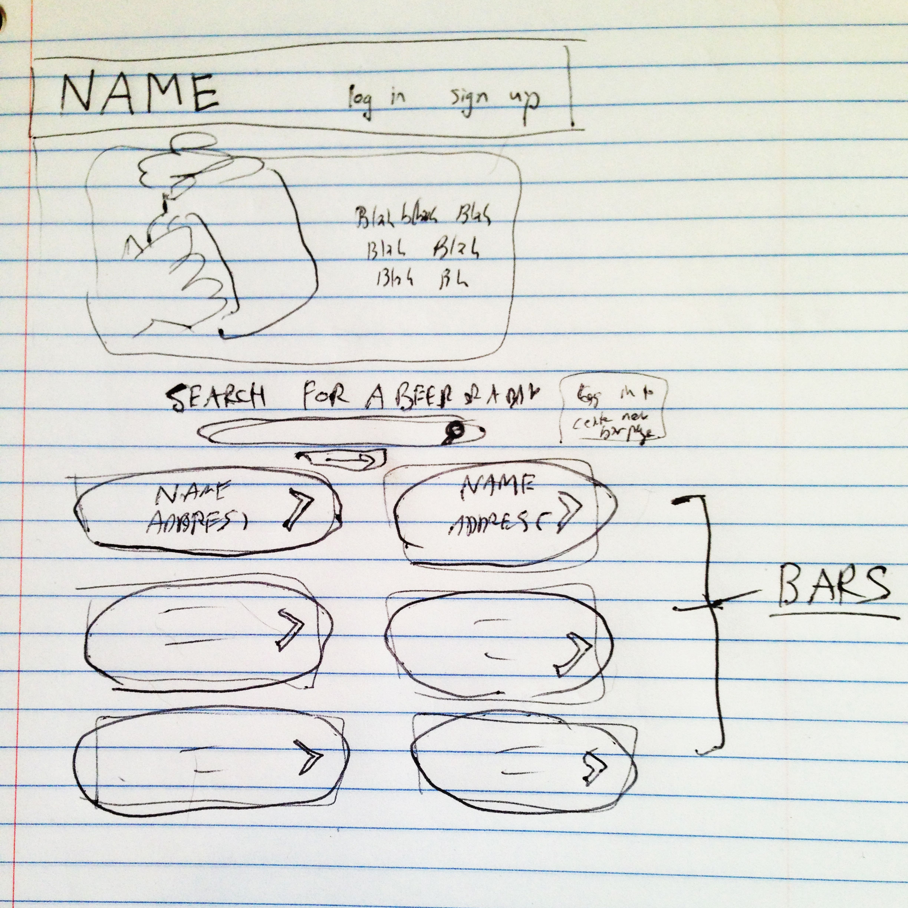

# What's On Tap?

##Overview
We created a mobile-first angular web app that allows users to check and update
lists of beers on tap at nearby bars. Visitors to the site can browse a lits of
nearby bars, check the list of beers on tap at each, and read some information
about each beer. Once they sign up, users can help keep the tap lists up to date
by adding and removing beers. Users can also update basic information about each
bar, such as the hours they're open and the address, as well as create a new page
for an unlisted bar.

##Technologies Used
* HTML, CSS, JavaScript
* AngularJS
* BreweryDB & BreweryDB-node
* node.js
* Express.js
* MongoDB & Mongoose
* Passport
* bCrypt

##Wireframe

##Links
* [Deployed App](http://whats-on-tap.herokuapp.com/)
* [GitHub](https://github.com/chandlerkelley/whats-on-tap)
* [Trello Board](https://trello.com/b/vIkrXd7b/beer-app)